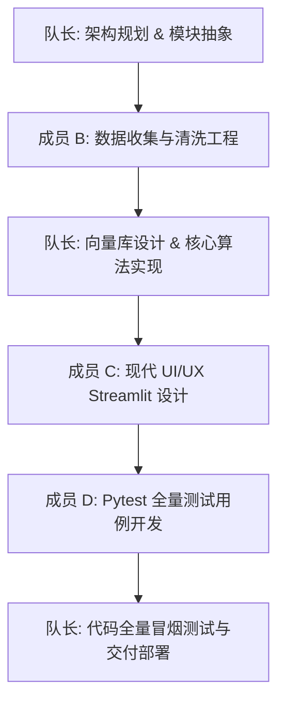

# 团队分工与职责说明 (Task Division)

本项目由四人团队协作开发。在研发过程中，由队长统一进行技术架构设计与任务统筹，各成员分工明确、紧密配合，实现全链路的快速交付。

---

## 🎯 团队角色与核心贡献

| 成员 | 职责分工 | 核心工作职责与输出物 |
| :--- | :--- | :--- |
| 👑 **队长 (您)** | **项目统筹 & RAG 架构师** | 1. **系统架构设计**：设计全链路 RAG（数据摄取 → 预处理分块 → 本地 Embedding 嵌入 → ChromaDB 持久化 → 混合检索 → 生成）流水线与降级回退机制。 2. **核心工程实现**：重构并深度优化本地向量数据库管理模块 `embed_store.py`；编写 `preprocess.py` 中的四层语义分块算法与极短文档兜底清洗策略。 3. **技术攻坚**：定位并攻克 Mock 绑定路径穿透引起的单测报错隐患，保障全链路测试 100% 通过；统筹项目最终交付与远程代码库同步。 |
| 🧑‍💻 **成员 B** | **数据工程师** | 1. **多源语料采集**：编写 `collect_corpus.py`、`collect_stackoverflow.py`、`collect_csdn.py` 等脚本，实现 Wikipedia、Stack Overflow 和 CSDN 的 API 离线 Markdown 提取与本地化存储。 2. **数据清洗工程**：设计 `clean_text()` 流水线过滤 HTML 与不可打印控制符；设计 32 线程并发元数据 LLM 提取及 429 频率超限指数退避重试算法。 |
| 🎨 **成员 C** | **前端开发工程师** | 1. **Web UI/UX 现代设计**：采用 Vanilla CSS + 现代视觉规范重新设计 Streamlit 前端（`app/streamlit_app.py` 与 `app/style.css`），实现可折叠毛玻璃卡片和精美的“调试模式”展示栏。 2. **交互逻辑开发**：维护多轮对话历史、Top-K 及相似度阈值滑块，编写核心 “➕ 数据管理” 模块，支持用户动态上传自定义文本入库。 |
| 🧪 **成员 D** | **测试与文档工程师** | 1. **单元与集成测试**：使用 `pytest` 编写覆盖全链路的单测用例（共 19 类 68 个），包含 YAML 嵌套解析、API 降级和 System 信号穿透等极端边缘用例。 2. **项目工程文档**：负责编写 `README.md`、答辩 PowerPoint 制作（`BigData_RAG_答辩演示.pptx`）以及技术总报告（`report.md`）的撰写与行数统计维护。 |

---

## 📈 协作开发流水线流程

项目的协作遵循规范的软件工程流水线：

在队长的统筹指挥下，四人团队实现了高效的多任务并行，项目总计历经 81 项细节调优与安全加固，并最终在 68 个单元与集成测试中实现了 **100% 成功通过 (100% Passed)**，系统质量与文档质量均达到优秀的工业级交付标准。
