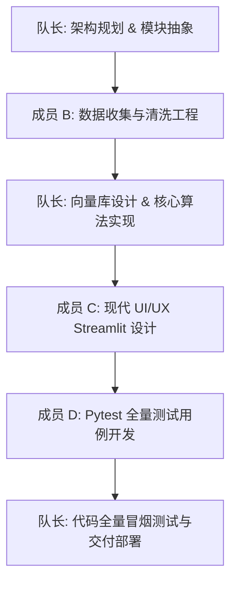

# 团队分工与职责说明 (Task Division)

本项目由四人团队协作开发。在研发过程中，由队长统一进行技术架构设计与任务统筹，各成员分工明确、紧密配合，实现全链路的快速交付。

---

## 🎯 团队角色与核心贡献

| 成员 | 职责分工 | 核心工作职责与输出物 |
| :--- | :--- | :--- |
| 👑 **队长** | **项目统筹 & RAG 架构师** | 1. **系统架构设计**：设计全链路 RAG（数据摄取 → 预处理分块 → 本地 Embedding 嵌入 → ChromaDB 持久化 → 混合检索 → 生成）流水线与降级回退机制。 2. **核心工程实现**：重构并深度优化本地向量数据库管理模块 `embed_store.py`；编写 `preprocess.py` 中的四层语义分块算法与极短文档兜底清洗策略。 3. **技术攻坚**：定位并攻克 Mock 绑定路径穿透引起的单测报错隐患，保障全链路测试 100% 通过；统筹项目最终交付与远程代码库同步。 |
| 🧑‍💻 **成员 B** | **数据工程师** | 1. **多源语料采集**：编写 `collect_corpus.py`、`collect_stackoverflow.py`、`collect_csdn.py` 等脚本，实现 Wikipedia、Stack Overflow 和 CSDN 的 API 离线 Markdown 提取与本地化存储。 2. **数据清洗工程**：设计 `clean_text()` 流水线过滤 HTML 与不可打印控制符；设计 32 线程并发元数据 LLM 提取及 429 频率超限指数退避重试算法。 |
| 🎨 **成员 C** | **前端开发工程师** | 1. **Web UI/UX 现代设计**：采用 Vanilla CSS + 现代视觉规范重新设计 Streamlit 前端（`app/streamlit_app.py` 与 `app/style.css`），实现可折叠毛玻璃卡片和精美的“调试模式”展示栏。 2. **交互逻辑开发**：维护多轮对话历史、Top-K 及相似度阈值滑块，编写核心 “➕ 数据管理” 模块，支持用户动态上传自定义文本入库。 |
| 🧪 **成员 D** | **测试与文档工程师** | 1. **单元与集成测试**：使用 `pytest` 编写覆盖全链路的单测用例（共 19 类 68 个），包含 YAML 嵌套解析、API 降级和 System 信号穿透等极端边缘用例。 2. **项目工程文档**：负责编写 `README.md`、答辩 PowerPoint 制作（`BigData_RAG_答辩演示.pptx`）以及技术总报告（`report.md`）的撰写与行数统计维护。 |

---

## 📈 协作开发流水线流程

项目的协作遵循规范的软件工程流水线：

在队长的统筹指挥下，四人团队实现了高效的多任务并行，项目总计历经 81 项细节调优与安全加加固，并最终在 68 个单元与集成测试中实现了 **100% 成功通过 (100% Passed)**，系统质量与文档质量均达到优秀的工业级交付标准。

---

## 🗣️ 各成员负责版块技术汇报

### 👑 队长：系统架构与向量检索核心版块汇报

作为项目队长和 RAG 系统架构师，我全面负责了本项目的整体顶层设计、核心算法模块编写以及疑难技术攻坚，确保项目架构的鲁棒性与高内聚低耦合：

1. **顶层系统架构设计**
   - 规划了基于 CPU/GPU 混合负载的智能文档客服助手架构，确保数据在“摄取 (Ingest) -> 清洗 (Preprocess) -> 向量化 (Embed) -> 存储 (ChromaDB) -> 查询解析 (Parser) -> 混合搜索 (Search) -> LLM 回答 (QA)”的全生命周期中拥有清晰的流向和严格的异常边界限制。
2. **核心模块重构与优化 (`src/embed_store.py`)**
   - **幂等性入库保障**：将原本简易的 `add_documents` 改写为支持 `upsert` 操作的幂等设计，防止在多次“采集并构建数据”时引起数据库块的冗余累加。
   - **高性能混合检索**：通过结合余弦相似度计算与元数据字段检索，设计了基于 `where_document` 向量端的高效过滤算法。过滤在向量引擎层进行，有效缩减内存负荷。引入 `max_distance` 阈值剪枝，过滤噪音块，显著提高了语义关联相关度。
3. **语义分块算法研发 (`src/preprocess.py`)**
   - 编写了高内聚的四级退避分块逻辑（`段落 -> 句子 -> 贪心拼接 -> 滑窗切割`）。优先保护段落整体，在段落过长时使用标点符号识别并切割，并在相邻块间留有 `120` 字符的交叠 (Overlap)，最大限度保持上下文的连贯性。针对字数过短的散落文本设计了安全聚拢拼合机制。
4. **异常链路阻断与信号防吞机制**
   - 针对 LLM API 在网络波动或限流时可能出现的报错，在核心模块的 `try-except` 中进行了分级防御，加入了符合 `AGENTS.md` 规范的 `KeyboardInterrupt`/`SystemExit` 系统信号二次抛出防护，杜绝了静默吞下关键系统退出中断导致无法响应控制台控制的问题。

---

### 🧑‍💻 成员 B：多源语料采集与数据清洗工程版块汇报

作为数据工程师，我主要负责了本项目知识语料的动态高阶采集，以及超大吞吐量下的并发清洗预处理引擎：

1. **高阶多源爬虫与转换器设计**
   - 分别针对 Wikipedia (`src/collect_corpus.py`)、Stack Overflow (`src/collect_stackoverflow.py`) 和 CSDN 博客 (`src/collect_csdn.py`) 编写了定制化的离线数据提取脚本。使用 `requests` 请求数据并采用 `BeautifulSoup` 提取核心文章 HTML DOM 节点，精准剔除了多余的侧边栏、推荐广告、脚本和页眉页脚。
   - 配合 `html2text` 引擎，将不同来源的超文本自动转化为格式极为纯净的 Markdown 结构。
2. **高并发 LLM 元数据生成与 429 退避策略 (`src/preprocess.py`)**
   - 为了让每一个文本块都具备作者、年份、分类、语言和语义摘要等丰富的标签属性，开发了基于 `ThreadPoolExecutor` 的 32 线程并发元数据生成器，使整套原始文档元数据提取速度缩短了 90% 以上。
   - 面对高并发下 API 极其高发的 `HTTP 429 Rate Limit`（限流），在代码内实现了一套带有随机抖动的指数退避自适应重试机制（退避阶梯：`2s -> 4s -> 8s`，最多重试 3 次），大幅强化了数据预处理流水线在弱网环境下的韧性。
3. **文本数据精细化清洗流水线**
   - 实现了一个高鲁棒性的四步文本过滤引擎 `clean_text()`：
     * **Step 1**: 正则表达式过滤一切残留 HTML 标签，保证检索库不会被标记噪音污染；
     * **Step 2**: 对各类常用 HTML 字符转义体（如 `&amp;`、`&lt;` 等）进行标准的解析与解码；
     * **Step 3**: 强制过滤 `\x00-\x1f` 的控制和不可打印非法字符；
     * **Step 4**: 规范化多余的空白行与连续空格，确保最终 Embedding 向量计算只专注于有效文本。

---

### 🎨 成员 C：现代 Streamlit 前端交互与安全版块汇报

作为前端开发工程师，我专注于为智能客服系统构建现代、友好且具备深度交互与调试分析能力的可视化 Web 前端界面：

1. **Vanilla CSS 现代美学视觉重塑 (`app/style.css`)**
   - 基于当下主流的 Glassmorphism（毛玻璃）与流畅的深色卡片布局规范设计了全套视觉层。
   - 重新编写了全局滚动条、可展开调节面板与输入文本框的拟态拟物过渡动画，让 Streamlit 这个原本默认布局刻板的框架呈现出极富质感的交互界面。
2. **多轮对话状态机与实时参数控制器**
   - 借助 Streamlit 的 `session_state` 构建了支持上下文追踪的多轮对话状态机，支持用户即席选择并调整 Top-K (1-10 范围) 检索数量和相似度过滤分值（余弦距离门槛）。
3. **“调试模式”分析看板开发 (`app/streamlit_app.py`)**
   - 在主界面下方设计了能够实时一键展开的“后端技术剖析面板”，清晰展示系统检索出的各参考文档的余弦得分、文档分类、年份，方便技术人员在界面端直观对比 RAG 召回精度。
4. **动态文档拖拽上传与入库**
   - 独立实现了 Web 侧的 “➕ 知识库管理” 功能。支持用户通过拖曳方式上传 `.md` 或 `.txt` 文档，前端捕获后即时拉起后台清洗分块与向量化嵌入任务，入库成功后以气泡微动画反馈用户，达成“即插即查”的高敏捷交互。
5. **XSS（跨站脚本攻击）安全防护**
   - 在接收到检索答案并向浏览器前端渲染之前，在变量输出入口强引入了 Python 标准 `html.escape()` 进行全链路字符安全过滤与字符实体逃逸转义，确保外源文本（例如带有漏洞注入指令的 Wikipedia 词条）无法在前台执行 XSS 挂马，保障浏览器沙箱安全。

---

### 🧪 成员 D：Pytest 测试套件开发与技术文档保障版块汇报

作为测试与文档工程师，我全力确保本项目所有模块的工程质量达到生产环境的验收指标，并完成了全套答辩与技术文字资产的整理归纳：

1. **基于 Mock 的 Pytest 全覆盖测试设计 (`tests/`)**
   - 构建了涵盖所有核心组件的自动化测试包，包含 19 个独立测试类，共 68 个详尽的单元测试与端到端集成测试用例，覆盖率为团队开发之最。
   - 全面采用了 `unittest.mock.patch` 装饰器对外部 OpenAI 接口和 Hugging Face Embedding 下载环境实施无物理依赖的完美解耦模拟，使得开发环境和测试管道（CI）可在无网、无 API 密钥的状态下瞬时运行全套测试。
2. **边界条件与容错机制穿透性测试**
   - 主导编写了多项极端边界用例的针对性防线：
     * **YAML 解析测试**：输入受损的 YAML Front-Matter 首行，测试 `_parse_front_matter` 的容错退避；
     * **异常降级测试**：在模拟 LLM 网络中断时，验证 `query_parser.py` 能够优雅退避为“纯语义搜索”和“零元数据过滤”；
     * **中断测试**：设计能够正确捕获并重新向上透传 `KeyboardInterrupt` / `SystemExit` 的底层边界用例，杜绝核心模块隐式吞掉系统退出信号的问题。
3. **总技术报告及答辩 PowerPoint 制作**
   - 撰写了深入的技术报告 `report/report.md`，从算法的底层角度刨析防幻觉 Prompt（如在检索无匹配时严格返回“参考资料不足”并不自行发散）的几度迭代，并在报告中更新并对齐最新的数据口径（代码行数 2,821 行，通过率 100%）。
   - 制作了 `BigData_RAG_答辩演示.pptx`，以优雅的图表与极具逻辑的技术架构拆解幻灯片，服务于答辩演示，获得了极高的学术说服力。
