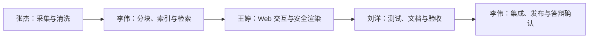

# 团队分工与答辩讲解说明

本项目由四人协作完成。答辩时统一采用“问题、负责模块、可验证证据、交付结果”四段式讲法，
避免只介绍职位或泛泛描述工作量。所有指标以 2026-06-21 最终验收结果为准。

## 一、统一汇报口径

| 指标 | 最终验收结果 | 证据 |
|---|---:|---|
| 知识库文档块 | 1,215,442 | Web 侧边栏状态、`vector_store/chroma.sqlite3` |
| 自动化测试 | 108 / 108 通过 | `python -m pytest tests/ -v` |
| 嵌入服务 | CUDA、1024 维 | `http://localhost:6008/health` |
| Web 状态刷新 | 约 1.5 秒 | 浏览器真实交互验收 |
| 公网演示 | Cloudflare Tunnel | `scripts/start_public_streamlit.ps1` |

真实 LLM 问答耗时会受 API 网络和模型响应影响，最终验收观察范围约为 8.5 至 30 秒。
答辩时不要承诺固定 6 秒，也不要宣称“零幻觉”或“生产环境绝对稳定”。应表述为：
系统通过来源引用、严格提示词、距离过滤和多层检索回退降低幻觉并提高可追溯性。

## 二、成员职责与可验证输出

| 成员 | 主要职责 | 可验证文件与结果 | 汇报核心句 |
|---|---|---|---|
| **李伟（组长）** | 架构设计、检索链路、向量库与最终集成 | `src/embed_store.py`、`src/preprocess.py`、`src/main.py` | “我负责把摄取、分块、检索和问答串成可运行的完整系统，并对百万级索引的稳定性负责。” |
| **张杰** | 多源语料采集、数据清洗、云端嵌入服务 | `src/collect_*.py`、`scripts/embedding_server.py`、`scripts/setup_autodl.sh` | “我负责把异构网页和文档转成干净语料，并用远程 GPU 完成百万级向量构建。” |
| **王婷** | Streamlit 前端、交互状态、安全渲染与响应式页面 | `app/streamlit_app.py`、`app/style.css`、`app/rendering.py` | “我负责让检索过程变成可操作、可查看来源、可在桌面和手机上稳定展示的问答界面。” |
| **刘洋** | 自动化测试、答辩材料、验收与交付保障 | `tests/`、`report/`、`pipeline_demo.ipynb` | “我负责用 108 项测试和真实 CLI/Web 验收把功能结论变成可复现证据，并整理答辩材料。” |

## 三、协作流程

协作不是四个互相独立的模块。数据字段结构由数据工程与检索模块共同确认；检索结果结构由
后端和前端共同确认；每次关键行为变更都由测试补充回归用例，最后再进入文档和演示脚本。

## 四、成员讲解稿

### 1. 李伟：系统架构与检索核心（约 60 秒）

> 我负责项目架构、向量库和最终集成。系统从文档摄取开始，经过清洗、四级语义分块、
> 1024 维向量化和 ChromaDB 持久化，再由查询解析、检索和答案生成组成在线链路。
> 百万级索引在本地查询时优先使用可用检索路径；当向量链路不适合当前模式或发生异常时，
> 系统会降级到 Chroma SQLite 正文检索，再降级到原始语料检索。最终不是“必须命中向量库”，
> 而是保证用户能得到有依据、可追溯的结果。

演示动作：打开架构图，指出 `ingest -> preprocess -> embed_store -> qa` 数据流。

交接句：下面由张杰说明这些数据如何采集、清洗并完成百万级向量构建。

### 2. 张杰：数据工程与算力卸载（约 60 秒）

> 我负责 Wikipedia、Stack Overflow 和 CSDN 三类语料采集，以及清洗和远程嵌入服务。
> 不同来源先统一转为 Markdown，再去除 HTML、控制字符和重复空白。离线建库阶段的数据量大，
> 因此使用 FastAPI 暴露 OpenAI 兼容的嵌入接口，把批量向量计算卸载到 AutoDL GPU；
> 本地保留 ETL、ChromaDB 写入和最终索引文件，降低本地显存压力。

演示动作：展示 `scripts/embedding_server.py` 的 `/health` 和 `/v1/embeddings` 接口。

交接句：数据进入知识库后，王婷负责把检索和来源展示成可用的网页交互。

### 3. 王婷：Web 交互与安全渲染（约 60 秒）

> 我负责 Streamlit Web 前端。页面支持推荐问题、连续问答、Top-K 设置、来源展开和知识库状态查看。
> 为避免百万级库导致页面卡顿，状态统计改为只读 SQLite 快速查询，实测约 1.5 秒返回。
> 回答使用 Markdown 解析器渲染标题、列表、代码和表格，同时禁用原始 HTML，避免脚本注入；
> 页面在桌面和 390×844 窄屏下均完成了无整页横向溢出的验收。

演示动作：依次点击两个推荐问题，再在输入框询问 Token 配额耗尽问题并展开来源。

交接句：最后由刘洋说明这些行为如何通过自动化测试和真实验收得到验证。

### 4. 刘洋：测试、文档与交付（约 60 秒）

> 我负责测试、文档和最终验收。当前测试套件共 108 项，覆盖摄取、清洗、检索、查询解析、
> 答案生成、Markdown 安全渲染及多层回退。最终验收不只运行 pytest，还执行了真实 CLI 问答、
> Web 推荐问题连续点击、刷新状态后输入问答、桌面和手机视口检查，并确认浏览器控制台和服务日志
> 无运行错误。公网演示通过 Cloudflare Tunnel 把本机 8502 服务映射到 `trycloudflare.com`。

演示动作：展示 `108 passed`、服务健康检查和公网地址。

收尾句：以上四部分对应数据、算法、交互和质量保障，形成从语料到可演示系统的完整闭环。

## 五、四分钟小组汇报顺序

| 时间 | 汇报人 | 内容 | 交接信号 |
|---:|---|---|---|
| 0:00-1:00 | 李伟 | 问题、架构、检索与回退 | 指向数据采集层 |
| 1:00-2:00 | 张杰 | 语料、清洗、AutoDL 嵌入 | 打开 Web 页面 |
| 2:00-3:00 | 王婷 | 推荐问题、来源、响应式与安全渲染 | 展示测试终端 |
| 3:00-4:00 | 刘洋 | 108 项测试、真实验收、公网演示 | 回到总结页 |

## 六、现场边界说明

- 当前 `.env` 为 local embedding 模式，Web 在线写入功能会主动关闭，避免前端加载本地大模型而卡顿。
- 现场新增语料应使用离线入库流程；不要演示已关闭的在线上传功能。
- `trycloudflare.com` Quick Tunnel 地址每次启动会变化，汇报前必须重新复制并扫码验证。
- 公网地址依赖本机 Streamlit、网络和 `cloudflared` 进程持续运行；保留 localhost 作为现场备用入口。
- 回答内容和耗时受远程 LLM API 影响，演示问题应提前完成一次预热并准备截图或录屏备份。
